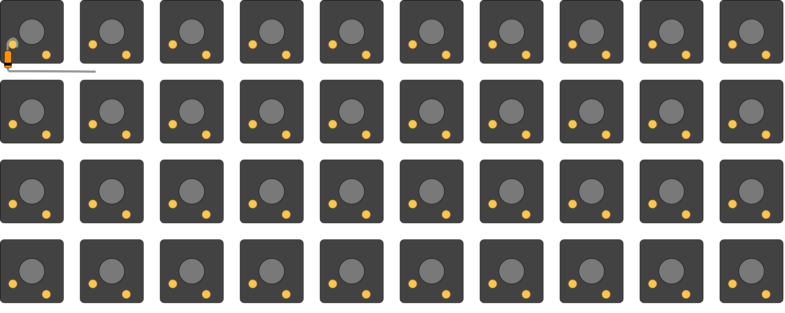
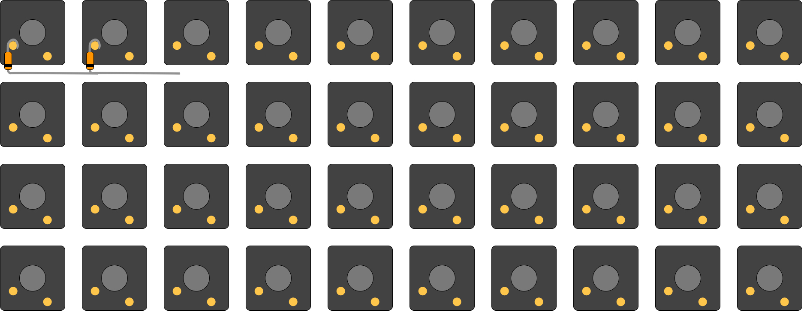
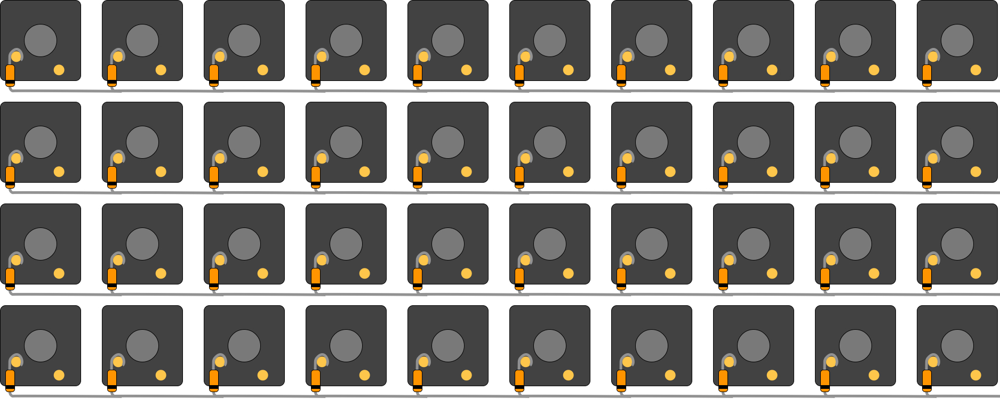
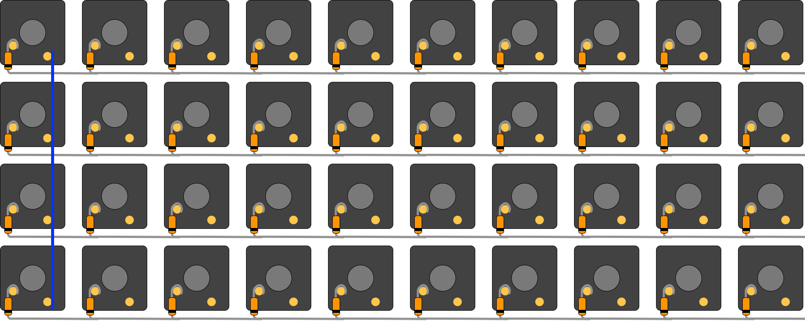
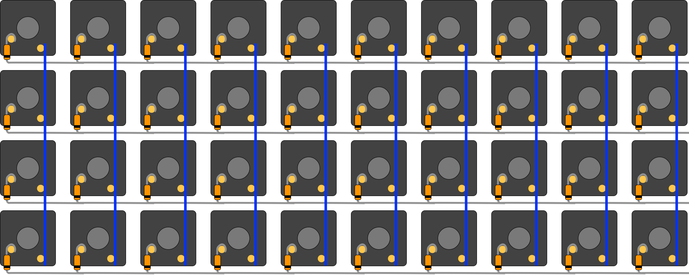
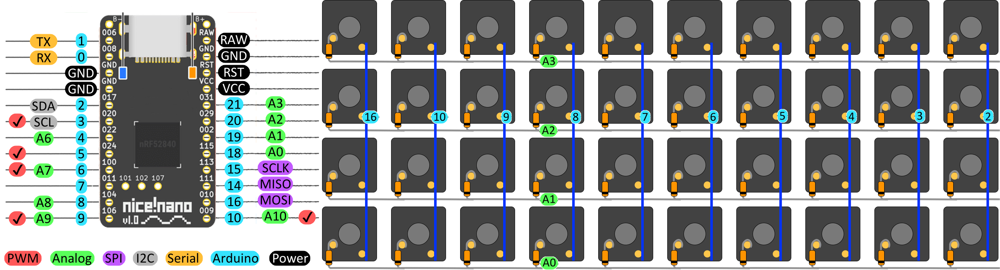

# Lak

Lak is a 40-key macro ~~pad~~ board

The stl files in this repo, with the rest of the physical components outlined in the bill of materials, can be used to create a 40-key programmable macroboard.

Lak is a hand-wired keyboard project powered by a [nice!nano](https://nicekeyboards.com/nice-nano) V1 and [ZMK](https://zmk.dev).
The shield config, keymap, and a prebuilt uf2 can be found [here](https://github.com/BrokenFlows/zmk-brokenflows).

## Instructions

The following instructions will provide details on how to assemble the project as well as covering the materials required.
The project requires some readily available keyboard components, some custom 3D printed components, and a nice!nano microcontroller which (at the time of writing) is available at somewhat frequent but irregular intervals.

### Hardware

The [tools](#Tools) and [materials](#Bill-of-Materials) will be used to assemble the final product, shown above. Once you have acquired the items required, you can follow the steps outlined in the [assembly](#Pre-Wiring) section.

#### Tools
- Soldering Iron
- Solder Wire
- 3D Printer/ 3D Printing Service/ or some means of mimicking [the case and parts](./stls/) listed below
- Scissors/ wire cutter
- Glue/ Hot Glue Gun
- **Optional:** wire stripper

#### Bill of Materials
Item # | Quantity | Part Name                                                 | Description
------:|---------:|:----------------------------------------------------------|-------------
1      | 1        | [lak case.stl](./stls/lak\ case.stl)                      | The case and integrated switch plate for the keyboard
2      | 1        | [lak sled.stl](./stls/lak\ sled.stl)                      | The housing for the nice!nano at the back of the case
3      | 1        | [lak base plate.stl](./stls/lak\ base\ plate.stl)         | The bottom cover for the keyboard, to protect the wiring once built
4      | 40       | [MX-Style Switches](https://kbdfans.com/collections/gateron-swithes/products/gateron-swtich-3pin-or-5pin?variant=35765200333) | MX-style key switches will serve as the button mechanism
5      | 40       | [MX-Style Keycaps](https://www.adafruit.com/product/5039) | MX-style keycaps, a uniform profile will work best
6      | 40       | [Diodes](https://www.adafruit.com/product/1641)           | Diodes for creating the key matrix
7      | 24       | [Wires](https://www.ebay.ie/itm/232901601951)             | Lengths of insulated solid-core wire to create the key matrix
8      | 1        | [nice!nano](https://nicekeyboards.com/nice-nano)          | The nice!nano microcontroller will 

The above BoM lists uniform profile keycaps and links to relegendable keycaps. I used a mixture of both of the following in my build:
- [Relgendable MX-Style Keycaps](https://www.adafruit.com/product/5039)
- [DSA Blank Keycaps](https://kbdfans.com/collections/dsa-profile/products/dsa-blank-keycaps-1u-10pcs)

If mixing and matching, or just getting one set, be sure to have 40 keycaps available for your build.

#### 3D Printing
I recommend 3D printing the stl files at the following settings:
Setting         | Value
:---------------|-----:
Filament        | PLA
Nozzle Diameter | < 0.4 mm
Layer Height    | < 0.2 mm
Infill          | 20% <
Supports        | On

#### Pre-Wiring
1. Insert the 40 switches into the case — the top of the switches should be on the shorter side relative to the plate.
2. At this point the keycaps can be placed on top of the switches. If using relegendable keycaps, insert the paper legends before placing the keycaps.
3. Place the nice!nano in its sled housing.

#### Wiring
This guide will go into light detail about the specifics of hand-wiring this keyboard.
This should be sufficient if you're familiar with the process of hand-wiring a keyboard.

The following guides will provide greater detail about the process of hand-wiring, though not the specifics of this board.
These may be helpful if it is your first time hand-wiring a keyboard:

- [QMK Firmware's _Hand-Wiring Guide_](https://github.com/qmk/qmk_firmware/blob/master/docs/hand_wire.md#wiring-the-matrix)
- [RoastPotatoes' _How to hand wire a Plank_](https://blog.roastpotatoes.co/guide/2015/11/04/how-to-handwire-a-planck/#switches)
- [Matt3o.com's _Hand-wiring a custom keyboard_](https://matt3o.com/hand-wiring-a-custom-keyboard/)

---

To start, bend the legs of a diode so that it can hook onto a switch pin and the leg can continue along the row of keys, as seen in the following picture.
Take care to orientate the cathode of the diode (the side marked with a black strip) away from the switch and towards the other diodes.
This is a `col2row` diode direction in the ZMK firmware.

At this point solder the diode to the switch pin. Then prepare another diode the same way at the next switch over.

Once both switches are soldered to the switch pins, solder the diode legs together along the row where the legs meet.

Carry on, repeating this process until there is one diode connected to each switch and all diodes in a row are connected also.

 
This completes the rows of the matrix. 

---

Next we connect the columns of the matrix with lengths of wire.
This can be done with three wires per column, one between each pair of switch pins, or with one long wire stripped where it passes the switch pins.

It is important that no bare wire touch any metal in the rows.
This is the benefit of using insulated wire.
If using uninsulated wire, using electrical tape or similar to mask where wires would meet.

Solder the wire in place where it passes each pin.
Whether using three wires or one length with stripped sections, there should be four solder joint per column.

This completes the columns of the matrix, and therefore the entire switch matrix.

---

To finish the wiring, we must connect the correct pins on the nice!nano to points on this matrix.
The following image shows a labelled diagram of a nice!nano and its pins, as well as a diagram showing which part of the matrix connects to which pin of the nice!nano.

It is important to note the frames of reference for each diagram:
- The diagram of the nice!nano shows the top, bumpier, side. If flipping the nice!nano, you will need to pay attention to wire the correct pins.
- The diagram of the keyboard matrix show the top as the furthest side of the keyboard from you when in use; this can be seen by the cutout in the case for the nice!nano.

Using more wire, solder connections between the pins of the nice!nano and the matching labels of the keyboard matrix.
Any point along the columns will make a valid connection.
Any point "below" the black line of the diode will make a valid connection for the rows.

